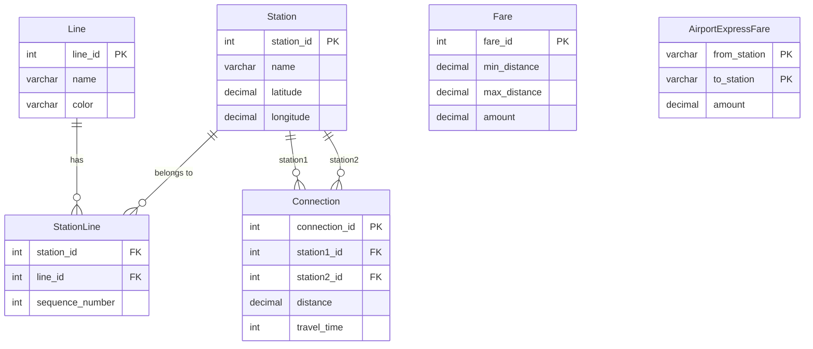

# Delhi Metro Navigator

Route optimizer for Delhi Metro using Dijkstra's algorithm on official GTFS data, with accurate fare calculation across regular, Airport Express, and Rapid Metro lines.

## Features

- Shortest path between any two stations using Dijkstra's algorithm
- Interchange penalties (5 min) for line changes
- Accurate fare calculation for Regular, Airport Express, and Rapid Metro lines
- Built on official Delhi government GTFS open transit data
- Web interface built with Flask

## Tech Stack

- **Backend:** Python, Flask
- **Database:** MySQL
- **Data:** Official GTFS feed from Delhi Open Transit Data
- **Algorithm:** Dijkstra's shortest path with weighted graph

## ER Diagram



## Database Schema

| Table | Description |
|-------|-------------|
| `Station` | 262 metro stations with coordinates |
| `Line` | 9 metro lines with color codes |
| `StationLine` | Many-to-many mapping of stations to lines with sequence order |
| `Connection` | Direct connections between adjacent stations with real GTFS distances and travel times |
| `Fare` | DMRC distance-based fare slabs (₹11 to ₹64) |
| `AirportExpressFare` | Fixed fares per station pair for Airport Express line |

Schema is in **3NF** — no partial or transitive dependencies.

## Setup

### Prerequisites

- Python 3.10+
- MySQL

### Installation

```bash
git clone https://github.com/AaryamanPSingh/metro-navigator
cd metro-navigator
python3 -m venv venv
source venv/bin/activate
pip install -r requirements.txt
```

### Environment Variables

Create a `.env` file in the root directory:

```
DB_PASSWORD=your_mysql_password
```

### Database Setup

```bash
mysql -u root -p -e "CREATE DATABASE metro_navigator;"
python3 seed_gtfs.py
```

### Run

```bash
python3 app.py
```

Visit `http://localhost:5000`

## How It Works

The Delhi Metro network is modeled as a weighted directed graph where each node is a `(station_id, line_id)` pair. This allows the same physical station to exist on multiple lines as separate nodes, enabling accurate interchange detection.

**Edge weights** are real inter-station travel times from the GTFS feed. A 5-minute penalty is added for any interchange between lines at the same station.

Dijkstra's algorithm finds the minimum-time path between source and destination. Fare is then calculated based on total distance — using DMRC distance slabs for regular lines, fixed station-pair lookup for Airport Express, and a flat ₹20 for Rapid Metro.
